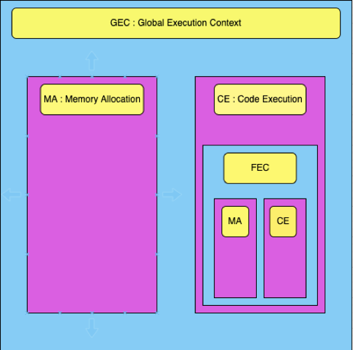

## JavaScript Engine:

A JavaScript engine is a program or an integral part of a web browser that interprets and executes JavaScript code. It's responsible for parsing the JavaScript source code, optimizing it, and executing the compiled code. JavaScript engines are a crucial component for running client-side JavaScript in web browsers.

**Key Responsibilities of a JavaScript Engine:**

1. **Parsing:** The engine parses the JavaScript source code to create an Abstract Syntax Tree (AST) for further processing.

2. **Optimization:** It performs various optimizations to improve the execution speed of the code. This may include techniques like Just-In-Time (JIT) compilation.

3. **Execution:** Finally, the engine executes the optimized code and produces the desired output.

**Types of JavaScript Engines:**

1. **V8 (Used in Chrome and Node.js):**
   - **Description:** V8 is an open-source JavaScript engine developed by Google for the Chrome browser and later adopted by Node.js.
   - **Key Features:**
     - Utilizes a fast JIT compiler for efficient code execution.
     - Implements techniques like hidden classes and inline caching for optimization.

2. **SpiderMonkey (Used in Firefox):**
   - **Description:** SpiderMonkey is the JavaScript engine developed by the Mozilla Foundation for the Firefox browser.
   - **Key Features:**
     - Early implementation of a JavaScript engine in a web browser.
     - Supports features like Just-In-Time (JIT) compilation for improved performance.

3. **JavaScriptCore (Used in Safari):**
   - **Description:** JavaScriptCore (also known as Nitro) is the JavaScript engine used in Apple's Safari browser.
   - **Key Features:**
     - Employs a fast interpreter and a high-performance optimizing compiler.
     - Supports advanced JavaScript features and technologies.

4. **Chakra (Used in Microsoft Edge):**
   - **Description:** Chakra was the JavaScript engine used in Microsoft Edge before the transition to the Blink engine (Chromium).
   - **Key Features:**
     - Included a Just-In-Time (JIT) compiler for faster code execution.
     - Supported various web technologies and features.

5. **Rhino:**
   - **Description:** Rhino is an open-source JavaScript engine developed by the Mozilla Foundation, mainly used for embedding JavaScript in Java applications.
   - **Key Features:**
     - Written in Java and allows seamless integration with Java applications.
     - Generally used for server-side applications rather than web browsers.

6. **JerryScript:**
   - **Description:** JerryScript is an open-source JavaScript engine designed for resource-constrained devices, particularly in the Internet of Things (IoT) space.
   - **Key Features:**
     - Optimized for low memory usage and efficient execution on IoT devices.
     - Provides a compact and lightweight alternative to larger JavaScript engines.

These JavaScript engines play a crucial role in enabling the execution of JavaScript code on various platforms, ranging from web browsers to server-side environments and resource-constrained devices. The competition among these engines has led to continuous improvements in performance and the adoption of new language features.


# JavaScript Execution Context

The JavaScript engine uses a **Call stack** and creates a special environment to handle the execution of the JavaScript code. This environment is known as the **Execution Context**.


The Execution Context contains the code that's currently running, and everything that aids in its execution. During the Execution Context run-time, the specific code gets parsed by a parser, the variables and functions are stored in memory, executable byte-code gets generated, and the code gets executed.

>**Call Stack**:

- A call stack is a mechanism for an interpreter (like the JavaScript interpreter in a web browser)
to keep track of its place in a script that calls multiple functions.
-  what function is currently being run and what functions are called from within that function, etc. or we can say that it stores global execution context and function execution context. 
- It maintains the order of execution of execution context. Whenever a code is executed the GEC is pushed into the stack first and later on as per the function invocation the execution context is pushed into the stack. 
- When the function code is done executiong the execution context is popped out and last the GEC also deleted.   


## Types of Execution Context

There are two kinds of Execution Context in JavaScript:

1. **Global Execution Context (GEC)**
2. **Function Execution Context (FEC)**


<!--  -->

<p align="center">
  
</p>


## Execution Context Lifecycle

The moment code gets executed, the **Global Execution Context (GEC)** gets created and pushed to the Call Stack. Inside the global or functional execution context, there are two phases:

1. **Memory Allocation (Creation Phase)**
2. **Code Execution (Execution Phase)**


### Memory Allocation

- **Variables declared using `var`**: Memory is allocated as `undefined` in the global scope.
- **Variables declared using `let` or `const`**: Memory is allocated as `undefined` in block scope.

This is the reason why we can access variables before initialization when declared using `var`; it will give `undefined`. However, if we try to access variables declared using `let` or `const` before their initialization, it will give a **Reference Error** because these variables will be in block scope and cannot be accessed until they are initialized. This is also known as the **temporal dead zone**.

 **Functions**: Memory is allocated as their actual value defined in the code.

### Code Execution

- **Variables**: Will get their actual value assigned to them.
- **Functions**: Will create a Functional Execution Context.

The moment a **Function Execution Context (FEC)** is created, it will be pushed to the Call Stack. Once the execution of the function is over, this FEC will be removed from the call stack, and the point of execution will return to the GEC.

<center>



<center>

## What is the DOM?

The DOM is a programming interface for web documents. It provides a structured representation of a web page's elements and content, treating them as objects that can be accessed, manipulated, and modified using programming languages like JavaScript. The DOM represents the document as a tree of objects, where each object corresponds to a part of the web page.

The DOM consists of a hierarchical structure that includes:

1. **Document Object:** The root of the DOM tree, representing the entire web page.

2. **Elements:** HTML tags like `<div>`, `<p>`, and `<a>` are represented as elements in the DOM tree.

3. **Attributes:** Element attributes such as `id`, `class`, and `href` are accessible through the DOM.

4. **Text and Content:** The text content within HTML elements is represented as text nodes in the DOM tree.

## Why is the DOM Essential?

The DOM is fundamental to web development for several reasons:

1. **Dynamic Web Pages:** The DOM allows developers to create dynamic and interactive web pages by changing the structure, content, and styles of a page in response to user interactions.

2. **Accessing Elements:** Developers can access and manipulate HTML elements to retrieve information, change content, or apply styles, making web pages more interactive.

3. **Event Handling:** The DOM enables the attachment of event handlers to elements, allowing developers to respond to user actions like clicks and keystrokes.

4. **Data Manipulation:** It facilitates the retrieval and modification of data from web forms and the transmission of data to servers (e.g., through AJAX).

5. **Content Updates:** Web pages can be updated in real-time without requiring a full page reload, improving the user experience.

6. **Cross-Browser Compatibility:** The DOM provides a consistent way to interact with web documents across various web browsers, ensuring compatibility.

## Uses of the DOM

The DOM is used in various ways in web development:

1. **Accessing Elements:** Developers can access HTML elements by their tag names, IDs, classes, or other attributes using JavaScript, allowing for content retrieval and modification.

2. **Changing Content:** Developers can dynamically update or change the content of web pages. For instance, you can update a news headline, change an image, or display user-generated content.

3. **Event Handling:** The DOM allows you to attach event listeners to elements, enabling actions in response to user interactions. This is essential for features like form validation, buttons, and menus.

4. **Form Manipulation:** The DOM provides the means to interact with forms, retrieve user inputs, and validate data before submission.

5. **Dynamic UI:** Developers can create dynamic user interfaces with elements that appear, disappear, or change in response to user actions, enhancing user experience.

6. **Animations:** The DOM can be used to animate elements by modifying their styles or properties over time.

7. **AJAX and API Interaction:** The DOM is crucial for making asynchronous requests to APIs, fetching data, and updating the web page without requiring a full page reload.


## 1. Introduction to JS DOM

### Definition

The Document Object Model (DOM) is a crucial concept in web development, especially in JavaScript. It represents the structure and content of a web page, allowing developers to interact with, manipulate, and update the content of a web document. Here's a detailed explanation of the DOM, why it's essential, and its uses:

## What is the DOM?

The DOM is a programming interface for web documents. It provides a structured representation of a web page's elements and content, treating them as objects that can be accessed, manipulated, and modified using programming languages like JavaScript. The DOM represents the document as a tree of objects, where each object corresponds to a part of the web page.

The DOM consists of a hierarchical structure that includes:

1. **Document Object:** The root of the DOM tree, representing the entire web page.

2. **Elements:** HTML tags like `<div>`, `<p>`, and `<a>` are represented as elements in the DOM tree.

3. **Attributes:** Element attributes such as `id`, `class`, and `href` are accessible through the DOM.

4. **Text and Content:** The text content within HTML elements is represented as text nodes in the DOM tree.

## Why is the DOM Essential?

The DOM is fundamental to web development for several reasons:

1. **Dynamic Web Pages:** The DOM allows developers to create dynamic and interactive web pages by changing the structure, content, and styles of a page in response to user interactions.

2. **Accessing Elements:** Developers can access and manipulate HTML elements to retrieve information, change content, or apply styles, making web pages more interactive.

3. **Event Handling:** The DOM enables the attachment of event handlers to elements, allowing developers to respond to user actions like clicks and keystrokes.

4. **Data Manipulation:** It facilitates the retrieval and modification of data from web forms and the transmission of data to servers (e.g., through AJAX).

5. **Content Updates:** Web pages can be updated in real-time without requiring a full page reload, improving the user experience.

6. **Cross-Browser Compatibility:** The DOM provides a consistent way to interact with web documents across various web browsers, ensuring compatibility.

## Uses of the DOM

The DOM is used in various ways in web development:

1. **Accessing Elements:** Developers can access HTML elements by their tag names, IDs, classes, or other attributes using JavaScript, allowing for content retrieval and modification.

2. **Changing Content:** Developers can dynamically update or change the content of web pages. For instance, you can update a news headline, change an image, or display user-generated content.

3. **Event Handling:** The DOM allows you to attach event listeners to elements, enabling actions in response to user interactions. This is essential for features like form validation, buttons, and menus.

4. **Form Manipulation:** The DOM provides the means to interact with forms, retrieve user inputs, and validate data before submission.

5. **Dynamic UI:** Developers can create dynamic user interfaces with elements that appear, disappear, or change in response to user actions, enhancing user experience.

6. **Animations:** The DOM can be used to animate elements by modifying their styles or properties over time.

7. **AJAX and API Interaction:** The DOM is crucial for making asynchronous requests to APIs, fetching data, and updating the web page without requiring a full page reload.

8. **Access and Manipulate Web Pages**: DOM allows JavaScript to interact with web pages. It can access and modify the content and structure of web documents.

9. **Dynamic Content**: You can use DOM to create, modify, or delete elements and attributes on a webpage.


## 2. DOM Traversal

### a. DOM Traversal Methods

#### 1. `getElementById(id)`

- **Description**: Retrieves an element with the specified `id` attribute.

- **Example**:
  ```javascript
  const element = document.getElementById("myElement");
  ```


1. **Change the Text and Style of a Heading Element:**

```html
<!DOCTYPE html>
<html>
  <body>
    <h1 id="myHeading">Hello, World!</h1>
  </body>
</html>
```

```javascript
// Access the heading element by its ID
const headingElement = document.getElementById('myHeading');

// Change the text and style
headingElement.textContent = "New Heading Text";
headingElement.style.color = "blue";
headingElement.style.backgroundColor = "yellow";
```

2. **Change the Color and Style of a Button Element:**

```html
<!DOCTYPE html>
<html>
  <body>
    <button id="myButton">Click me</button>
  </body>
</html>
```

```javascript
// Access the button element by its ID
const buttonElement = document.getElementById('myButton');

// Change the button text color and background color
buttonElement.style.color = "white";
buttonElement.style.backgroundColor = "green";
buttonElement.textContent = "Updated Button Text";
```

3. **Change the Style of a Div Element:**

```html
<!DOCTYPE html>
<html>
  <body>
    <div id="myDiv" style="width: 100px; height: 100px; background-color: lightgray;"></div>
  </body>
</html>
```

```javascript
// Access the div element by its ID
const divElement = document.getElementById('myDiv');

// Change the background color and size
divElement.style.backgroundColor = "blue";
divElement.style.width = "150px";
divElement.style.height = "150px";
```


#### 2. `getElementsByClassName(className)`

- **Description**: Retrieves an HTMLCollection of elements with the specified `class` attribute.

- **Example**:
  ```javascript
  const elements = document.getElementsByClassName("myClass");
  ```

#### 3. `getElementsByTagName(tagName)`

- **Description**: Retrieves an HTMLCollection of elements with the specified tag name.

- **Example**:
  ```javascript
  const elements = document.getElementsByTagName("p");
  ```

#### 4. `querySelector(selector)`

- **Description**: Retrieves the first element that matches the specified CSS selector.

- **Example**:
  ```javascript
  const element = document.querySelector("#myElement .myClass");
  ```


```html
<!DOCTYPE html>
<html>
<head>
    <title>querySelector Example</title>
</head>
<body>
    <div id="content">
        <h1>Hello, World!</h1>
        <p>This is a simple example using querySelector.</p>
    </div>
</body>
</html>
```

You can use `querySelector` to select and manipulate elements as follows:

```javascript
// Select the first <p> element inside the #content div using querySelector
const paragraph = document.querySelector("#content p");

// Change the text content of the selected paragraph
paragraph.textContent = "This paragraph has been updated using querySelector.";

// Change the style of the selected paragraph
paragraph.style.color = "blue";

// Select and modify the <h1> element inside the #content div
const heading = document.querySelector("#content h1");
heading.textContent = "Hello, DOM!";

// You can also select elements by tag name
const title = document.querySelector("title");
title.textContent = "Updated Title";
```

In this example, `querySelector` is used to select the first paragraph (`<p>`) element within the `#content` div, update its text content and style. It is also used to select and modify the `h1` element within the `#content` div and the `title` element in the `head` section of the HTML document.


#### 5. `querySelectorAll(selector)`

- **Description**: Retrieves all elements that match the specified CSS selector, returning a NodeList.

- **Example**:
  ```javascript
  const elements = document.querySelectorAll("p.myClass");
  ```


```html
<!DOCTYPE html>
<html>
  <body>
    <div class="container">
      <p class="selected">Paragraph 1</p>
      <p>Paragraph 2</p>
      <p class="selected">Paragraph 3</p>
      <p>Paragraph 4</p>
    </div>
  </body>
</html>
```

You can use `querySelectorAll` to select all `<p>` elements with the class "selected":

```javascript
// Select all <p> elements with the class "selected"
const selectedParagraphs = document.querySelectorAll('.selected');

// Loop through the selected elements and do something with them
selectedParagraphs.forEach(paragraph => {
  console.log(paragraph.textContent);
});

// Output:
// "Paragraph 1"
// "Paragraph 3"
```


### b. DOM Traversal Properties

#### 1. `parentElement`

- **Description**: Returns the parent element of the current element.

- **Example**:
  ```javascript
  const parent = element.parentElement;
  ```

#### 2. `parentNode`

- **Description**: Returns the parent node of the current node.

- **Example**:
  ```javascript
  const parent = element.parentNode;
  ```

`parentElement` and `parentNode` are properties in the Document Object Model (DOM) that allow you to access the parent node of an element. However, they have some differences in behavior, particularly in how they handle whitespace text nodes. Let's explore the differences with examples:

1. **`parentElement`**:

   - `parentElement` specifically returns the parent element of an element. It skips over text nodes and other types of nodes that are not elements.
   - This property provides a convenient way to navigate the DOM when you are primarily interested in elements.

   Example:

   ```html
   <div id="parent">
     <p>Child Paragraph</p>
   </div>
   ```

   ```javascript
   const childParagraph = document.querySelector('p');
   const parentDiv = childParagraph.parentElement;
   console.log(parentDiv.id); // Output: "parent"
   ```


2. **`parentNode`**:

   - `parentNode` returns the parent node of an element, which can be any type of node, including text nodes and comment nodes.
   - It provides more flexibility but may require additional checks to ensure you're working with an element if that's your specific goal.

   Example:

   ```html
   <div id="parent">
     Text Node
     <p>Child Paragraph</p>
   </div>
   ```

   ```javascript
   const childParagraph = document.querySelector('p');
   const parent = childParagraph.parentNode;
   console.log(parent.id); // Output: "parent" (it accesses the parent element)
   console.log(parent.firstChild); // Output: #text (it accesses the text node)
   ```


**Summary**:

- If you are specifically interested in the parent element and want to skip over non-element nodes, `parentElement` is a more straightforward choice.
- If you want to access the parent node regardless of its type (element, text, comment, etc.), `parentNode` provides greater flexibility but may require additional checks to handle different node types.


#### 3. `childNodes`

- **Description**: Returns a live NodeList of all child nodes, including text and comment nodes.

- **Example**:
  ```javascript
  const childNodes = element.childNodes;
  ```

#### 4. `children`

- **Description**: Returns a live HTMLCollection of child elements of the current element.

- **Example**:
  ```javascript
  const childElements = element.children;
  ```
Example of childNode and children

```html
<div id="myDIV" style="background:coral; padding:16px;">
    <p>First p element this</p>
    <p>First p element this</p>
    <p>Second p element</p>
  <h1>lorem</h1>
</div>

<p>The number of child nodes in "myDIV" are:</p>
<p id="demo"></p>
```

```javascript
const element = document.getElementById("myDIV");
let numb = element.children.length;
console.log(element.children);

document.getElementById("demo").innerHTML = numb;
```

#### 5. `nextSibling`

- **Description**: Returns the next sibling node (including text and comment nodes) of the current node.

- **Example**:
  ```javascript
  const nextNode = element.nextSibling;
  ```
Example:

```javascript
<ul><li id="item1">Coffee (first item)</li><li id="item2">Tea (second item)</li></ul>

<p>The HTML content of the next sibling of the first list item is:</p>
<p id="demo"></p>

<p><strong>Note:</strong> Whitespace between elements is considered text nodes.</p>
<p>If you add whitespace between the two li elements, the result will be "undefined".</p>

<script>
let text = document.getElementById("item1").nextSibling.innerHTML; 
document.getElementById("demo").innerHTML = text;
</script>
```

#### 6. `nextElementSibling`

- **Description**: Returns the next sibling element of the current element.

- **Example**:
  ```javascript
  const nextElement = element.nextElementSibling;
  ```

  The difference between `nextSibling` and `nextElementSibling` lies in the type of nodes they select in the DOM:

1. **`nextSibling`**:
   - `nextSibling` is a property in the DOM that returns the next sibling node of the current element, which can be any type of node, including elements, text nodes, and comments.
   - It does not discriminate between different types of nodes; it selects the next sibling node, whatever type it may be.
   - If the next sibling is an element, you can access its properties and attributes.

2. **`nextElementSibling`**:
   - `nextElementSibling` is a more specific property that returns the next sibling **element** of the current element, effectively skipping over text nodes, comment nodes, and other non-element nodes.
   - It is particularly useful when you want to navigate through the DOM and work with the adjacent element.

Here's an example that illustrates the difference:

```html
<div id="container">
  Text Node 1
  <p>Paragraph 1</p>
  <!-- This is a comment -->
  <p id="target">Paragraph 2</p>
  Text Node 2
</div>
```

Using `nextSibling`:

```javascript
const targetElement = document.getElementById('target');
const nextSibling = targetElement.nextSibling;

console.log(nextSibling.nodeName); // Output: #text (text node, not an element)
```

Using `nextElementSibling`:

```javascript
const targetElement = document.getElementById('target');
const nextElementSibling = targetElement.nextElementSibling;

console.log(nextElementSibling.nodeName); // Output: P (next element)
```

In the `nextSibling` example, we get the next sibling node, which is a text node. In the `nextElementSibling` example, we get the next sibling element, which is a `<p>` element. This demonstrates how `nextSibling` selects nodes of any type, while `nextElementSibling` specifically selects the next sibling element.

#### 7. `firstChild`

- **Description**: Returns the first child node (including text and comment nodes) of the current node.

- **Example**:
  ```javascript
  const firstChild = element.firstChild;
  ```

#### 8. `firstElementChild`

- **Description**: Returns the first child element of the current element.

- **Example**:
  ```javascript
  const firstElement = element.firstElementChild;
  ```

#### 9. `lastChild`

- **Description**: Returns the last child node (including text and comment nodes) of the current node.

- **Example**:
  ```javascript
  const lastChild = element.lastChild;
  ```

#### 10. `lastElementChild`

- **Description**: Returns the last child element of the current element.

- **Example**:
  ```javascript
  const lastElement = element.lastElementChild;
  ```

```html
<div id="myDiv">
    <p>First paragraph</p>
    <p>Second paragraph</p>
    <p>Third paragraph</p>
</div>
```

You can use `firstChild` and `lastChild` to access the first and last child nodes of the `myDiv` element as follows:

```javascript
// Access the first child node of the element
const firstChild = document.getElementById("myDiv").firstChild;

// Access the last child node of the element
const lastChild = document.getElementById("myDiv").lastChild;

// Output the text content of the first and last child nodes
console.log("First Child: " + firstChild.textContent);
console.log("Last Child: " + lastChild.textContent);
```


## DOM Modifications

### a. Create / Remove / Append Elements

#### Definition

- **Create Elements**: Involves creating new HTML elements in the DOM using JavaScript. These elements can be any valid HTML element, and they can be added to the document.

- **Remove Elements**: Involves removing existing elements from the DOM. This is useful for cleaning up or dynamically updating the page.

- **Append Elements**: Involves adding elements as children to other elements in the DOM, allowing you to build and modify the document structure dynamically.

#### Syntax

1. **Create Element**:
   ```javascript
   const newElement = document.createElement("tagName");
   ```

2. **Remove Element**:
   ```javascript
   const elementToRemove = document.getElementById("elementId");
   elementToRemove.remove();
   ```

3. **Append Element**:
   ```javascript
   const parentElement = document.getElementById("parentElementId");
   parentElement.appendChild(newElement);
   ```

#### Example

**Create Element**:

```html
<div id="container">
    <p>This is a container.</p>
</div>
```

```javascript
// Create a new element and set its content
const newParagraph = document.createElement("p");
newParagraph.textContent = "This is a dynamically created paragraph.";

// Append the new element to the container
const container = document.getElementById("container");
container.appendChild(newParagraph);
```

**Remove Element**:

```html
<div id="container">
    <p>This is a container.</p>
</div>
```

```javascript
// Remove the <p> element from the container
const elementToRemove = document.querySelector("p");
elementToRemove.remove();
```

**Append Element**:

```html
<div id="container">
    <p>This is a container.</p>
</div>
```

```javascript
// Create a new element and set its content
const newParagraph = document.createElement("p");
newParagraph.textContent = "This is a dynamically created paragraph.";

// Append the new element to the container
const container = document.getElementById("container");
container.appendChild(newParagraph);
```

### b. Change / Update Text / Styles / Properties of an Element

#### Definition

- **Change Text**: Involves modifying the text content within an element. You can set, update, or replace the text content of an element.

- **Change Styles**: Allows you to modify the visual presentation of an element by adjusting its CSS styles.

- **Change Properties**: Refers to modifying attributes and properties of HTML elements, such as changing the `src` attribute of an image.

#### Syntax

1. **Change Text**:
   ```javascript
   element.textContent = "newText";
   ```

2. **Change Styles**:
   ```javascript
   element.style.property = "value";
   ```

3. **Change Properties**:
   ```javascript
   element.propertyName = "newValue";
   ```

#### Example

**Change Text**:

```html
<p id="myParagraph">This is some text.</p>
```

```javascript
// Update the text content of the paragraph
const paragraph = document.getElementById("myParagraph");
paragraph.textContent = "This is the updated text content.";
```

**Change Styles**:

```html
<p id="myParagraph">This is some text.</p>
```

```javascript
// Change the font color and background color of the paragraph
const paragraph = document.getElementById("myParagraph");
paragraph.style.color = "blue";
paragraph.style.backgroundColor = "lightgray";
```

**Change Properties**:

```html

```

```javascript
// Change the source (src) attribute of the image
const image = document.getElementById("myImage");
image.src = "new-image.jpg";
```


`innerText`, `innerHTML`, and `textContent` are properties in JavaScript that allow you to interact with and manipulate the content of HTML elements. They serve different purposes and have distinct behaviors:

1. **`innerText`**:
   - **Purpose**: It gets or sets the visible text content within an element, excluding any hidden or styled elements.
   - **Example**:

   Suppose you have the following HTML:

   ```html
   <div id="myElement">
       This is some <span style="display: none;">hidden</span> text.
   </div>
   ```

   ```javascript
   const element = document.getElementById("myElement");
   const text = element.innerText;
   console.log(text);
   // Output: "This is some text."
   ```

   In this example, `innerText` returns the visible text content within the element and omits the hidden `<span>` element.

2. **`innerHTML`**:
   - **Purpose**: It gets or sets the HTML content of an element, including any HTML tags and their content.
   - **Example**:

   Suppose you have the following HTML:

   ```html
   <div id="myElement">
       This is some <b>bold</b> text.
   </div>
   ```

   ```javascript
   const element = document.getElementById("myElement");
   const html = element.innerHTML;
   console.log(html);
   // Output: "This is some <b>bold</b> text."
   ```

   In this example, `innerHTML` returns the HTML content of the element, including the `<b>` tag and its content.

3. **`textContent`**:
   - **Purpose**: It gets or sets the text content of an element, including all text, regardless of whether it's styled or hidden.
   - **Example**:

   Suppose you have the following HTML:

   ```html
   <div id="myElement">
       This is some <span style="display: none;">hidden</span> text.
   </div>
   ```

   ```javascript
   const element = document.getElementById("myElement");
   const text = element.textContent;
   console.log(text);
   // Output: "This is some hidden text."
   ```


`setAttribute` and `getAttribute` are two methods in JavaScript that allow you to set and get attributes of HTML elements. They are used to interact with and manipulate attributes in the DOM.

1. **`setAttribute`**:
   - **Purpose**: It sets or updates the value of an attribute for an HTML element.
   - **Syntax**: `element.setAttribute(attributeName, attributeValue)`
   - **Example**:

   ```html
   
   ```

   ```javascript
   // Set the "src" attribute of the image
   const image = document.getElementById("myImage");
   image.setAttribute("src", "new-image.jpg");
   ```

   In this example, we use `setAttribute` to change the `src` attribute of an image element, replacing the original image with a new one.

2. **`getAttribute`**:
   - **Purpose**: It retrieves the value of an attribute for an HTML element.
   - **Syntax**: `element.getAttribute(attributeName)`
   - **Example**:

   ```html
   <a id="myLink" href="https://example.com">Visit Example</a>
   ```

   ```javascript
   // Get the value of the "href" attribute of the link
   const link = document.getElementById("myLink");
   const linkHref = link.getAttribute("href");
   console.log(linkHref);
   ```

   In this example, we use `getAttribute` to retrieve the `href` attribute's value from a link element and log it to the console.


### Date Method:

In JavaScript, the `Date` object provides various methods to retrieve different components of a date and time. Here are notes on the commonly used `get` methods along with examples of how to implement them:

1. **`getDate()`**:
   - Returns the day of the month (1-31).
   - Example:

   ```javascript
   const today = new Date();
   const dayOfMonth = today.getDate();
   console.log(`Day of the month: ${dayOfMonth}`);
   ```

2. **`getMonth()`**:
   - Returns the month (0-11), with 0 being January and 11 being December.
   - Example:

   ```javascript
   const today = new Date();
   const month = today.getMonth(); // 0-based index
   console.log(`Month: ${month + 1}`); // Adding 1 to match human-readable months
   ```

3. **`getFullYear()`**:
   - Returns the year with the century as a four-digit number (e.g., 2023).
   - Example:

   ```javascript
   const today = new Date();
   const year = today.getFullYear();
   console.log(`Year: ${year}`);
   ```

4. **`getHours()`**:
   - Returns the hour of the day (0-23).
   - Example:

   ```javascript
   const now = new Date();
   const hour = now.getHours();
   console.log(`Current hour: ${hour}`);
   ```

5. **`getMinutes()`**:
   - Returns the minutes of the hour (0-59).
   - Example:

   ```javascript
   const now = new Date();
   const minutes = now.getMinutes();
   console.log(`Current minutes: ${minutes}`);
   ```

6. **`getSeconds()`**:
   - Returns the seconds of the minute (0-59).
   - Example:

   ```javascript
   const now = new Date();
   const seconds = now.getSeconds();
   console.log(`Current seconds: ${seconds}`);
   ```

7. **`getMilliseconds()`**:
   - Returns the milliseconds of the second (0-999).
   - Example:

   ```javascript
   const now = new Date();
   const milliseconds = now.getMilliseconds();
   console.log(`Current milliseconds: ${milliseconds}`);
   ```

8. **`getDay()`**:
   - Returns the day of the week (0-6), with 0 being Sunday and 6 being Saturday.
   - Example:

   ```javascript
   const today = new Date();
   const dayOfWeek = today.getDay();
   const days = ["Sunday", "Monday", "Tuesday", "Wednesday", "Thursday", "Friday", "Saturday"];
   console.log(`Day of the week: ${days[dayOfWeek]}`);
   ```

These `get` methods allow you to extract specific date and time components from a `Date` object, making it easier to work with and manipulate date-related data in JavaScript.


In JavaScript, the `Date` object provides various methods to set different components of a date and time. These methods are used to change specific parts of a date without affecting other components. Here are notes on the commonly used `set` methods along with examples of how to implement them:

1. **`setDate(day)`**:
   - Sets the day of the month (1-31).
   - Example:

   ```javascript
   const today = new Date();
   today.setDate(15); // Set the day to the 15th
   console.log(today);
   ```

2. **`setMonth(month)`**:
   - Sets the month (0-11), with 0 being January and 11 being December.
   - Example:

   ```javascript
   const today = new Date();
   today.setMonth(5); // Set the month to June
   console.log(today);
   ```

3. **`setFullYear(year)`**:
   - Sets the year with the century as a four-digit number (e.g., 2023).
   - Example:

   ```javascript
   const today = new Date();
   today.setFullYear(2025); // Set the year to 2025
   console.log(today);
   ```

4. **`setHours(hour)`**:
   - Sets the hour of the day (0-23).
   - Example:

   ```javascript
   const now = new Date();
   now.setHours(14); // Set the hour to 2:00 PM
   console.log(now);
   ```

5. **`setMinutes(minutes)`**:
   - Sets the minutes of the hour (0-59).
   - Example:

   ```javascript
   const now = new Date();
   now.setMinutes(30); // Set the minutes to 30
   console.log(now);
   ```

6. **`setSeconds(seconds)`**:
   - Sets the seconds of the minute (0-59).
   - Example:

   ```javascript
   const now = new Date();
   now.setSeconds(45); // Set the seconds to 45
   console.log(now);
   ```

7. **`setMilliseconds(milliseconds)`**:
   - Sets the milliseconds of the second (0-999).
   - Example:

   ```javascript
   const now = new Date();
   now.setMilliseconds(500); // Set the milliseconds to 500
   console.log(now);
   ```

8. **`setUTCFullYear(year)`**:
   - Sets the year with the century as a four-digit number (e.g., 2023) in UTC time.
   - Example:

   ```javascript
   const today = new Date();
   today.setUTCFullYear(2025); // Set the UTC year to 2025
   console.log(today);
   ```


**Event Handlers:**
Event handlers in JavaScript are functions that can be attached to HTML elements to specify what should happen when an event occurs. Events can be triggered by various interactions, such as clicking a button, moving the mouse, submitting a form, and more.

**Common Event Handlers:**
1. **`onclick`**: Fires when an element is clicked.
2. **`onmouseover`**: Fires when the mouse pointer is moved over an element.
3. **`onmouseout`**: Fires when the mouse pointer is moved out of an element.
4. **`onsubmit`**: Fires when a form is submitted.

**Syntax to Attach an Event Handler:**
```javascript
element.onclick = function() {
    // Event handling code
};
```

**Example of Event Handling:** 

**1. `onchange` Event:**
   - The `onchange` event is triggered when the value of an input element changes. It is commonly used with form elements like text inputs and select boxes.
   
   ```html
   <input type="text" id="myInput" onchange="handleChange()">
   <p id="output">Change detected!</p>

   <script>
       function handleChange() {
           document.getElementById("output").textContent = "Change detected!";
       }
   </script>
   ```

**2. `onclick` Event:**
   - The `onclick` event is triggered when an element is clicked.

   ```html
   <button id="myButton" onclick="handleClick()">Click Me</button>
   <p id="output">Button not clicked yet.</p>

   <script>
       function handleClick() {
           document.getElementById("output").textContent = "Button clicked!";
       }
   </script>
   ```

**3. `onmouseover` Event:**
   - The `onmouseover` event is triggered when the mouse pointer is moved over an element.

   ```html
   <div id="myDiv" onmouseover="handleMouseOver()">Hover over me</div>
   <p id="output">Mouse not over the div.</p>

   <script>
       function handleMouseOver() {
           document.getElementById("output").textContent = "Mouse over the div!";
       }
   </script>
   ```

**4. `onmouseout` Event:**
   - The `onmouseout` event is triggered when the mouse pointer is moved out of an element.

   ```html
   <div id="myDiv" onmouseout="handleMouseOut()">Move the mouse away</div>
   <p id="output">Mouse not out of the div yet.</p>

   <script>
       function handleMouseOut() {
           document.getElementById("output").textContent = "Mouse out of the div!";
       }
   </script>
   ```

**5. `onkeydown` Event:**
   - The `onkeydown` event is triggered when a keyboard key is pressed down.

   ```html
   <input type="text" id="myInput" onkeydown="handleKeyDown()">
   <p id="output">Key not pressed yet.</p>

   <script>
       function handleKeyDown() {
           document.getElementById("output").textContent = "Key pressed!";
       }
   </script>
   ```

**6. `onload` Event:**
   - The `onload` event is triggered when a page or an image has finished loading.

   ```html
   
   <p id="output">Image not loaded yet.</p>

   <script>
       function handleLoad() {
           document.getElementById("output").textContent = "Image loaded!";
       }
   </script>
   ```

In each example, the event handler function is invoked when the specified event occurs, and it updates the content on the page accordingly.

In this example, when the button is clicked, an alert with the message "Button Clicked!" is displayed.


## addEventListener: 


**1. `onchange` Event with `addEventListener`:
   - The `change` event is triggered when the value of an input element changes.

   ```html
   <input type="text" id="myInput">
   <p id="output">Change detected!</p>

   <script>
       const inputElement = document.getElementById("myInput");
       inputElement.addEventListener("change", function() {
           document.getElementById("output").textContent = "Change detected!";
       });
   </script>
   ```

**2. `onclick` Event with `addEventListener`:
   - The `click` event is triggered when an element is clicked.

   ```html
   <button id="myButton">Click Me</button>
   <p id="output">Button not clicked yet.</p>

   <script>
       const buttonElement = document.getElementById("myButton");
       buttonElement.addEventListener("click", function() {
           document.getElementById("output").textContent = "Button clicked!";
       });
   </script>
   ```

**3. `onmouseover` Event with `addEventListener`:
   - The `mouseover` event is triggered when the mouse pointer is moved over an element.

   ```html
   <div id="myDiv">Hover over me</div>
   <p id="output">Mouse not over the div.</p>

   <script>
       const divElement = document.getElementById("myDiv");
       divElement.addEventListener("mouseover", function() {
           document.getElementById("output").textContent = "Mouse over the div!";
       });
   </script>
   ```

**4. `onmouseout` Event with `addEventListener`:
   - The `mouseout` event is triggered when the mouse pointer is moved out of an element.

   ```html
   <div id="myDiv">Move the mouse away</div>
   <p id= "output">Mouse not out of the div yet.</p>

   <script>
       const divElement = document.getElementById("myDiv");
       divElement.addEventListener("mouseout", function() {
           document.getElementById("output").textContent = "Mouse out of the div!";
       });
   </script>
   ```

**5. `onkeydown` Event with `addEventListener`:
   - The `keydown` event is triggered when a keyboard key is pressed down.

   ```html
   <input type="text" id="myInput">
   <p id="output">Key not pressed yet.</p>

   <script>
       const inputElement = document.getElementById("myInput");
       inputElement.addEventListener("keydown", function() {
           document.getElementById("output").textContent = "Key pressed!";
       });
   </script>
   ```

**6. `onload` Event with `addEventListener`:
   - The `load` event is triggered when a page or an image has finished loading.

   ```html
   
   <p id="output">Image not loaded yet.</p>

   <script>
       const imageElement = document.getElementById("myImage");
       imageElement.addEventListener("load", function() {
           document.getElementById("output").textContent = "Image loaded!";
       });
   </script>
   ```


**`setTimeout` and `setInterval`** are both JavaScript functions that allow you to execute a piece of code or a function after a certain amount of time. However, they are used in slightly different ways:

1. **`setTimeout`**:

   - **Definition**: `setTimeout` is used to execute a function or code block once, with a specified delay (in milliseconds), after which the function is called.

   - **Syntax**: `setTimeout(function, delay)`

   - **Example**:

     ```javascript
     function greet() {
         console.log("Hello, world!");
     }

     // Execute the greet function after 2000 milliseconds (2 seconds)
     setTimeout(greet, 2000);
     ```

   In this example, the `greet` function is executed once, with a delay of 2 seconds.

2. **`setInterval`**:

   - **Definition**: `setInterval` is used to repeatedly execute a function or code block at specified intervals (in milliseconds) until it is cleared.

   - **Syntax**: `setInterval(function, interval)`

   - **Example**:

     ```javascript
     let count = 0;

     function incrementAndLog() {
         count++;
         console.log(`Count: ${count}`);
     }

     // Execute the incrementAndLog function every 1000 milliseconds (1 second)
     const intervalID = setInterval(incrementAndLog, 1000);

     // Clear the interval after 5 seconds
     setTimeout(() => {
         clearInterval(intervalID);
         console.log("Interval cleared.");
     }, 5000);
     ```

   In this example, the `incrementAndLog` function is executed every 1 second. After 5 seconds, the `clearInterval` function is called to stop the interval.

**Key Differences**:

- `setTimeout` is used for executing a function once after a specified delay, while `setInterval` is used for repeatedly executing a function at specified intervals until cleared.

- You need to manually call `clearInterval` to stop the execution of a function set by `setInterval`, whereas `setTimeout` executes the function only once.

- `setTimeout` can be used for delayed execution of a function or action, such as showing a message after a certain time, while `setInterval` is useful for creating continuous processes, like updating a timer or polling a server at regular intervals.

In summary, `setTimeout` is for executing a function once after a delay, while `setInterval` is for executing a function repeatedly at specified intervals.


### Event Bubbling and Capturing:**
Event propagation in the DOM tree happens in two phases: capturing and bubbling. These phases are essential when dealing with nested elements and event delegation.

- **Capturing Phase**: The event starts from the root element and goes down the tree to the target element. It's less commonly used.

- **Bubbling Phase**: The event starts from the target element and bubbles up the tree to the root element.

**Example of Event Bubbling:**
```html
<div id="outer">
    <p id="inner">Click me!</p>
</div>
<script>
    document.getElementById("outer").onclick = function() {
        alert("Outer div clicked!");
    };
    document.getElementById("inner").onclick = function(event) {
        alert("Inner paragraph clicked!");
        event.stopPropagation(); // Stop event propagation
    };
</script>
```

In this example, clicking the inner paragraph triggers both the inner and outer event handlers because of event bubbling. However, the `event.stopPropagation()` method is used to stop the event from further propagating, preventing the outer event handler from firing.

Understanding event handling and event propagation is crucial for creating interactive web applications and handling user interactions effectively.


## classList

Certainly! Here are detailed notes for each of the `classList` properties and methods along with proper examples that include HTML and JavaScript code.

**1. `add(class1, class2, ...)`**:
   - The `add()` method adds one or more classes to the element's `classList`.

   **Example**:

   ```html
   <div id="myElement" class="initial-class">This is a div.</div>
   <button id="addClassBtn">Add Class</button>

   <script>
       const element = document.getElementById("myElement");
       const addButton = document.getElementById("addClassBtn");

       addButton.addEventListener("click", function() {
           element.classList.add("new-class");
       });
   </script>
   ```


In this example, clicking the "Add Class" button adds the class "new-class" to the `myElement`.

**2. `contains(class)`**:
   - The `contains()` method returns `true` if the element's `classList` contains the specified class; otherwise, it returns `false.

   **Example**:

   ```html
   <div id="myElement" class="initial-class">This is a div.</div>
   <button id="checkClassBtn">Check Class</button>

   <script>
       const element = document.getElementById("myElement");
       const checkButton = document.getElementById("checkClassBtn");

       checkButton.addEventListener("click", function() {
           const hasClass = element.classList.contains("initial-class");
           alert(hasClass ? "Has class!" : "Doesn't have class.");
       });
   </script>
   ```

   In this example, clicking the "Check Class" button checks if the `myElement` has the class "initial-class."

**3. `entries()`**:
   - The `entries()` method returns an iterator with key/value pairs representing the classes in the `classList`.

   **Example**:

   ```html
   <div id="myElement" class="class1 class2 class3">This is a div.</div>
   <button id="iterateClassesBtn">Iterate Classes</button>

   <script>
       const element = document.getElementById("myElement");
       const iterateButton = document.getElementById("iterateClassesBtn");

       iterateButton.addEventListener("click", function() {
           const classEntries = element.classList.entries();
           for (const [index, className] of classEntries) {
               console.log(`Class at index ${index}: ${className}`);
           }
       });
   </script>
   ```

   Clicking the "Iterate Classes" button logs the classes and their indices in the `myElement`.

**4. `forEach(callback)`**:
   - The `forEach()` method executes a callback function for each token (class) in the `classList`.

   **Example**:

   ```html
   <div id="myElement" class="class1 class2 class3">This is a div.</div>
   <button id="iterateClassesBtn">Iterate Classes</button>

   <script>
       const element = document.getElementById("myElement");
       const iterateButton = document.getElementById("iterateClassesBtn");

       iterateButton.addEventListener("click", function() {
           element.classList.forEach((className, index) => {
               console.log(`Class at index ${index}: ${className}`);
           });
       });
   </script>
   ```

   Clicking the "Iterate Classes" button logs the classes and their indices in the `myElement`.

**5. `item(index)`**:
   - The `item()` method returns the class at the specified index in the `classList`.

   **Example**:

   ```html
   <div id="myElement" class="class1 class2 class3">This is a div.</div>
   <button id="getClassBtn">Get Class</button>

   <script>
       const element = document.getElementById("myElement");
       const getClassButton = document.getElementById("getClassBtn");

       getClassButton.addEventListener("click", function() {
           const className = element.classList.item(1); // Get the class at index 1
           alert(`Class at index 1: ${className}`);
       });
   </script>
   ```

   Clicking the "Get Class" button retrieves the class at index 1 in the `myElement`.

**6. `keys()`**:
   - The `keys()` method returns an iterator with the keys (indices) of the classes in the `classList`.

   **Example**:

   ```html
   <div id="myElement" class="class1 class2 class3">This is a div.</div>
   <button id="iterateClassesBtn">Iterate Classes</button>

   <script>
       const element = document.getElementById("myElement");
       const iterateButton = document.getElementById("iterateClassesBtn");

       iterateButton.addEventListener("click", function() {
           const classKeys = element.classList.keys();
           for (const key of classKeys) {
               console.log(`Index: ${key}`);
           }
       });
   </script>
   ```

   Clicking the "Iterate Classes" button logs the indices of classes in the `myElement`.

**7. `length`**:
   - The `length` property returns the number of tokens (classes) in the `classList`.

   **Example**:

   ```html
   <div id="myElement" class="class1 class2 class3">This is a div.</div>
   <button id="getClassCountBtn">Get Class Count</button>

   <script>
       const element = document.getElementById("myElement");
       const getClassCountButton = document.getElementById("getClassCountBtn");

       getClassCountButton.addEventListener("click", function() {
           const classCount = element.classList.length;
           alert(`Number of classes: ${classCount}`);
       });
   </script>
   ```

   Clicking the "Get Class Count" button retrieves the number of classes in the `myElement`.

**8. `remove(class1, class2, ...)`**:
   - The `remove()` method removes one or more classes from the element's `classList

`.

   **Example**:

   ```html
   <div id="myElement" class="class1 class2 class3">This is a div.</div>
   <button id="removeClassBtn">Remove Class</button>

   <script>
       const element = document.getElementById("myElement");
       const removeButton = document.getElementById("removeClassBtn");

       removeButton.addEventListener("click", function() {
           element.classList.remove("class2");
       });
   </script>
   ```

   Clicking the "Remove Class" button removes the class "class2" from the `myElement`.

**9. `replace(oldClass, newClass)`**:
   - The `replace()` method replaces an existing class with a new class in the `classList`.

   **Example**:

   ```html
   <div id="myElement" class="class1 class2 class3">This is a div.</div>
   <button id="replaceClassBtn">Replace Class</button>

   <script>
       const element = document.getElementById("myElement");
       const replaceButton = document.getElementById("replaceClassBtn");

       replaceButton.addEventListener("click", function() {
           element.classList.replace("class2", "new-class");
       });
   </script>
   ```

   Clicking the "Replace Class" button replaces the class "class2" with "new-class" in the `myElement`.

**10. `supports(class)`**:
    - The `supports()` method returns `true` if a token (class) is one of an attribute's supported tokens; otherwise, it returns `false`.

    **Example**:

    ```html
    <div id="myElement" class="class1 class2 class3">This is a div.</div>
    <button id="checkSupportBtn">Check Support</button>

    <script>
        const element = document.getElementById("myElement");
        const checkButton = document.getElementById("checkSupportBtn");

        checkButton.addEventListener("click", function() {
            const supportsClass = element.classList.supports("class2");
            alert(supportsClass ? "Class supported!" : "Class not supported.");
        });
    </script>
    ```

    Clicking the "Check Support" button checks if the class "class2" is supported in the `myElement`.

**11. `toggle(class, force)`**:
    - The `toggle()` method toggles between adding and removing a class in the `classList`. If `force` is provided, it determines whether the class should be added or removed.

    **Example**:

    ```html
    <div id="myElement" class="initial-class">This is a div.</div>
    <button id="toggleClassBtn">Toggle Class</button>

    <script>
        const element = document.getElementById("myElement");
        const toggleButton = document.getElementById("toggleClassBtn");

        toggleButton.addEventListener("click", function() {
            element.classList.toggle("new-class");
        });
    </script>
    ```

    Clicking the "Toggle Class" button adds or removes the class "new-class" in the `myElement` based on its current state.

**12. `values()`**:
    - The `values()` method returns an iterator with the values (classes) in the `classList`.

    **Example**:

    ```html
    <div id="myElement" class="class1 class2 class3">This is a div.</div>
    <button id="iterateValuesBtn">Iterate Values</button>

    <script>
        const element = document.getElementById("myElement");
        const iterateButton = document.getElementById("iterateValuesBtn");

        iterateButton.addEventListener("click", function() {
            const classValues = element.classList.values();
            for (const value of classValues) {
                console.log(`Class: ${value}`);
            }
        });
    </script>
    ```


<!-- ```
<!DOCTYPE html>
<html>
<head>
    <title>nextSibling Example</title>
</head>
<body>
    <ul>
        <li>Item 1</li><li>Item 2</li><li>Item 3</li><li>Item 4</li><li>Item 5</li>
    </ul>
    <button id="nextSiblingBtn">Get Next Sibling</button>

    <script>
        const nextSiblingButton = document.getElementById("nextSiblingBtn");

        nextSiblingButton.addEventListener("click", function () {
            const listItem = document.querySelector("li"); // Get the first list item
            const nextSibling = listItem.nextSibling;

            if (nextSibling) {
                alert("Next Sibling: " + nextSibling.textContent);
            } else {
                alert("No valid next sibling found.");
            }
        });
    </script>
</body>
</html>
``` -->


